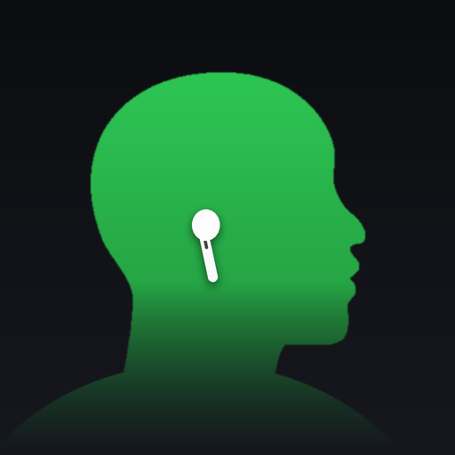

<p align="center">
  
</p>

<h1 align="center">Nape</h1>

<p align="center"><strong>Screen Time for your neck.</strong><br>
Nape reads head motion from your AirPods, measures how far you lean forward, and nudges you before your neck pays for it. Everything stays on your iPhone.</p>

<p align="center">
  <a href="https://voxyfy.github.io/nape/">Website</a> ·
  <a href="https://voxyfy.github.io/nape/privacy.html">Privacy</a> ·
  <a href="https://voxyfy.github.io/nape/support.html">Support</a> ·
  <a href="#türkçe">Türkçe</a>
</p>

---

## What it does

- **Live tilt.** A side-profile figure leans as your head does. Green when upright, orange when you've dropped below your threshold.
- **Nudges.** Lean too long and Nape plays a sound in your AirPods and taps your phone. Five sounds, three intensity presets, escalating repeats if you ignore it.
- **Time leaning and average load.** Minutes spent past your threshold today, and the average weight your neck carried while you leaned, in kilograms, from a static lever model of the cervical spine (see [Science](#science)). Shown as an estimate, with the math one tap away.
- **Dynamic Island & Lock Screen.** A Live Activity keeps your current angle at the top of the screen while tracking.
- **Apple Watch.** Nudges reach your wrist: as a mirrored notification when the iPhone is locked, or instantly through the watch app's session. A complication shows tilt and today's leaning time.
- **Background tracking.** Switch apps or lock the phone; tracking continues via a silent audio session.
- **Private by design.** No account, no network, no analytics. Head motion never leaves the device.

## Requirements

| | |
|---|---|
| iPhone | iOS 17 or later |
| Headphones | AirPods Pro (any), AirPods 3, AirPods 4, AirPods Max, Beats Fit Pro. AirPods 1 and 2 have no motion sensor. |
| Build | Xcode 27, [xcodegen](https://github.com/yonaskolb/XcodeGen) |

## Build

```sh
brew install xcodegen
xcodegen generate
open Nape.xcodeproj
```

`Nape.xcodeproj` is generated from `project.yml` and is not committed. Run on a real device with supported AirPods; the simulator has no head-motion data, so it ships a fake sensor that cycles through a lean (`-simSeed` seeds a week of history, `-simDisconnected` shows the no-headphones state).

## Architecture

```
Nape/
├── App/          NapeApp, AppSettings (UserDefaults-backed)
├── Motion/       HeadMotionService  — CMHeadphoneMotionManager wrapper, connection state
│                 HeadphoneInfo      — name + symbol from the audio route
├── Engine/       PostureEngine      — threshold, dwell timer, daily/hourly accumulation, nudge trigger
│                 NeckLoad           — tilt → cervical load (kg), lever model
│                 LiveActivityController, WatchBridge (WatchConnectivity)
├── Alerts/       Alerter (haptic + sound), NudgeNotifier, NudgeSound, NudgeIntensity, BackgroundKeepAlive
├── Storage/      DayStore — daily stats as JSON in UserDefaults (90 days)
├── Shared/       HeadSilhouetteShape, WornAirPodView, NapeActivityAttributes, WatchPayload (compiled into app, widgets and watch)
├── Views/        Home, HeadProfile, TodayChart, Welcome, Calibration, Settings, MetricInfo, Style
└── Resources/    Localizable.xcstrings (EN source, TR), nudge_*.wav, Assets
NapeWidgets/      Live Activity (Dynamic Island + Lock Screen)
NapeWatch/        watchOS app: live status, wrist haptics, extended runtime session
NapeWatchWidget/  watchOS complication (circular, corner, inline, rectangular)
docs/             GitHub Pages site
```

Native Swift and SwiftUI, no third-party dependencies. Sounds are synthesized (see `docs/tools/make_sounds.py`), the silhouette was traced from a reference image with potrace and normalized into a SwiftUI `Shape`.

## Science

Nape estimates the compressive load at the base of the neck with a static lever model:

```
load = m × (cos θ + 4.9 × sin θ)
```

`m` is head-and-neck mass (5.4 kg by default, or 8.1 % of body weight after Dempster 1955), `θ` the forward tilt. `cos θ` is the share of the head's weight pressing down the spine; `4.9 × sin θ` is the pull of the extensor muscles holding the head up, whose leverage is roughly five times shorter than the head's. The lever ratio is tuned so the model reproduces Hansraj (2014) within 1.5 kg: 15° → 12 kg, 30° → 18 kg, 45° → 22 kg, 60° → 26 kg.

**Average load** is that figure averaged over the minutes you spent past your threshold. It is an estimate from a static model, not a clinical measure; treat both numbers as trends to lower.

References: Hansraj K.K., *Surgical Technology International* 25 (2014) · Vasavada et al., *Ergonomics* 58 (2015) · Dempster W.T., *Annals NYAS* 63 (1955).

## Localization

English (source) and Turkish, via a single string catalog. To add a language, add a column to `Nape/Resources/Localizable.xcstrings` in Xcode; the widget shares the same file.

## Roadmap

- [x] Core tracking, calibration, nudges, daily stats
- [x] Live Activity
- [x] Apple Watch app, wrist nudges and complication
- [ ] Share card
- [ ] TestFlight, App Store

## License

[PolyForm Noncommercial 1.0.0](LICENSE). Free to use, study and modify for noncommercial purposes.

---

## Türkçe

**Boynunuz için Ekran Süresi.** Nape, AirPods'unuzun hareket sensöründen başınızın açısını okur, öne eğimi ölçer ve uzun süre eğik kaldığınızda uyarır. Hiçbir veri iPhone'unuzdan çıkmaz.

- **Canlı eğim.** Yandan bir profil figürü başınızla birlikte eğilir; dikken yeşil, eşiği geçince turuncu.
- **Uyarılar.** AirPods'ta ses ve telefonda titreşim. Beş ses, üç şiddet ön ayarı (Nazik, Sert, Acımasız), görmezden gelirseniz kademeli sertleşme.
- **Eğik süre ve ortalama yük.** Bugün eşiği aşarak geçirdiğiniz dakikalar ve o sürede boynunuza binen ortalama ağırlık (kg), servikal omurga için statik kaldıraç modelinden; hesap tek dokunuşla görülebilir, tıbbi iddia yok.
- **Dynamic Island ve Kilit Ekranı.** Takip sürerken anlık açı ekranın üstünde.
- **Arka planda çalışır.** Uygulama değiştirin ya da telefonu kilitleyin; yeter ki yukarı kaydırıp kapatmayın.

Gereksinimler: iOS 17+, AirPods Pro / 3 / 4 / Max ya da Beats Fit Pro (AirPods 1 ve 2'de sensör yok). Derleme için Xcode 27 ve xcodegen; proje dosyası `project.yml`'den üretilir.

Kod tanımlayıcıları İngilizce, yorumlar Türkçe yazılmıştır. Lisans: PolyForm Noncommercial 1.0.0.
